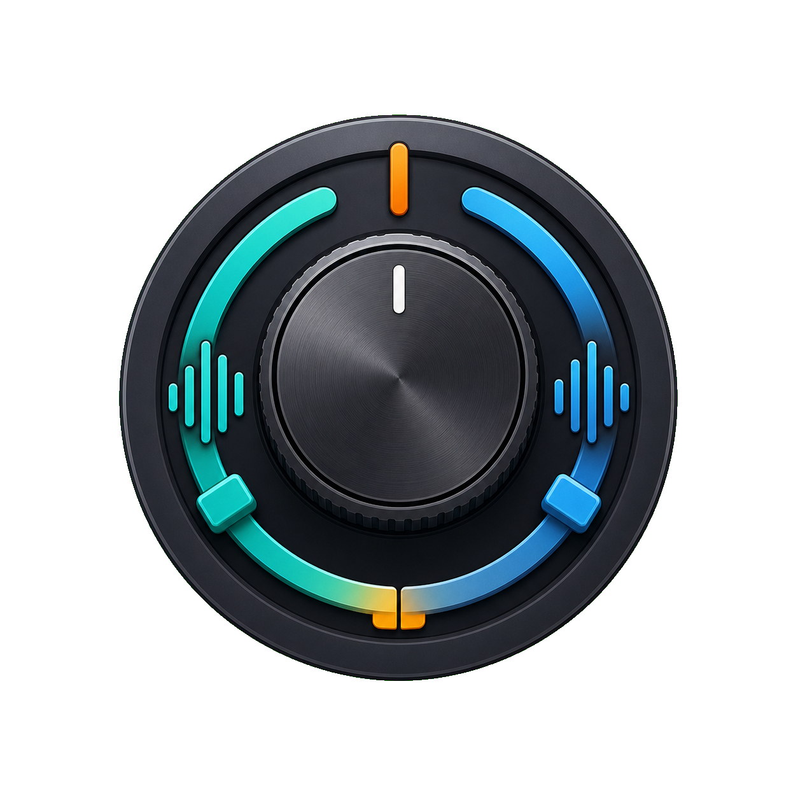

# SonarSlideVB



VoiceMeeter Banana/Potato inside parameters are controlled from a small Windows tray app to mimic SteelSeries Nova 7 style ChatMix.

## Behavior

- Runs as a tray app.
- Uses VoiceMeeter Remote API.
- Adjusts two configured VoiceMeeter parameters, usually `Strip[n].Gain` or `Bus[n].Gain`.
- Default hotkeys:
  - Toggle enabled: `Ctrl+Alt+M`
  - Game side: `Ctrl+Alt+Left`
  - Chat side: `Ctrl+Alt+Right`
  - Center: `Ctrl+Alt+Down`

The Settings window shows VoiceMeeter-style names instead of Remote API parameter names. Select the layout first, then choose Game and Chat from the dropdowns.

Settings also includes:

- Dial mode:
  - `Nova 7`: reads the supported SteelSeries Nova 7 HID ChatMix report directly.
  - `Custom`: keeps the current HID/raw input capture path for diagnostics, but does not apply ChatMix changes yet.
  - `Off`: stops dial monitoring.
- Nova 7 retry ms: delay between device discovery/open/read retries.
- Nova 7 retry count: consecutive retry limit. `0` means retry forever.
- Step: shown in dial-scale units. The default display value `1.0` is saved internally as `0.1`.
- Start with Windows: starts the tray app from the current user's Windows startup registry key.

Default layout is VoiceMeeter Banana:

- Game: `Voicemeeter Input`
- Chat: `Voicemeeter AUX Input`

Internally these are saved as VoiceMeeter Remote API parameters such as `Strip[3].Gain` and `Strip[4].Gain`.

## Nova 7 dial

Nova 7 dial support is enabled by default through `Dial mode: Nova 7`. The app looks for SteelSeries `VID 1038` / `PID 2202` HID devices and prioritizes the vendor usage page used by the ChatMix report. Reports are written to `%AppData%\SonarSlideVB\app.log`.

The expected ChatMix report is compatible with Linux HID patches and community implementations: marker `0x45` on Nova 7 USB dongles, with the following two bytes representing the Game/Chat balance in the `0..100` range. The app also accepts `0x2D` as an alternate marker seen in related notes. It normalizes that value to `0..100` and applies it to the configured VoiceMeeter Game/Chat targets.

`Dial mode: Custom` is currently capture-only. It is useful for collecting HID/raw input diagnostics in `app.log`, but custom device mapping and ChatMix application are not supported yet.

## Build

Review `scripts/build.ps1`, then run it in PowerShell. The script uses Visual Studio MSBuild and does not require the .NET SDK command-line tools.

```powershell
.\scripts\build.ps1
```

The release output is written to `artifacts\publish`.

## VoiceMeeter DLL

If the app cannot find `VoicemeeterRemote64.dll`, open Settings from the tray icon and select the DLL manually.
